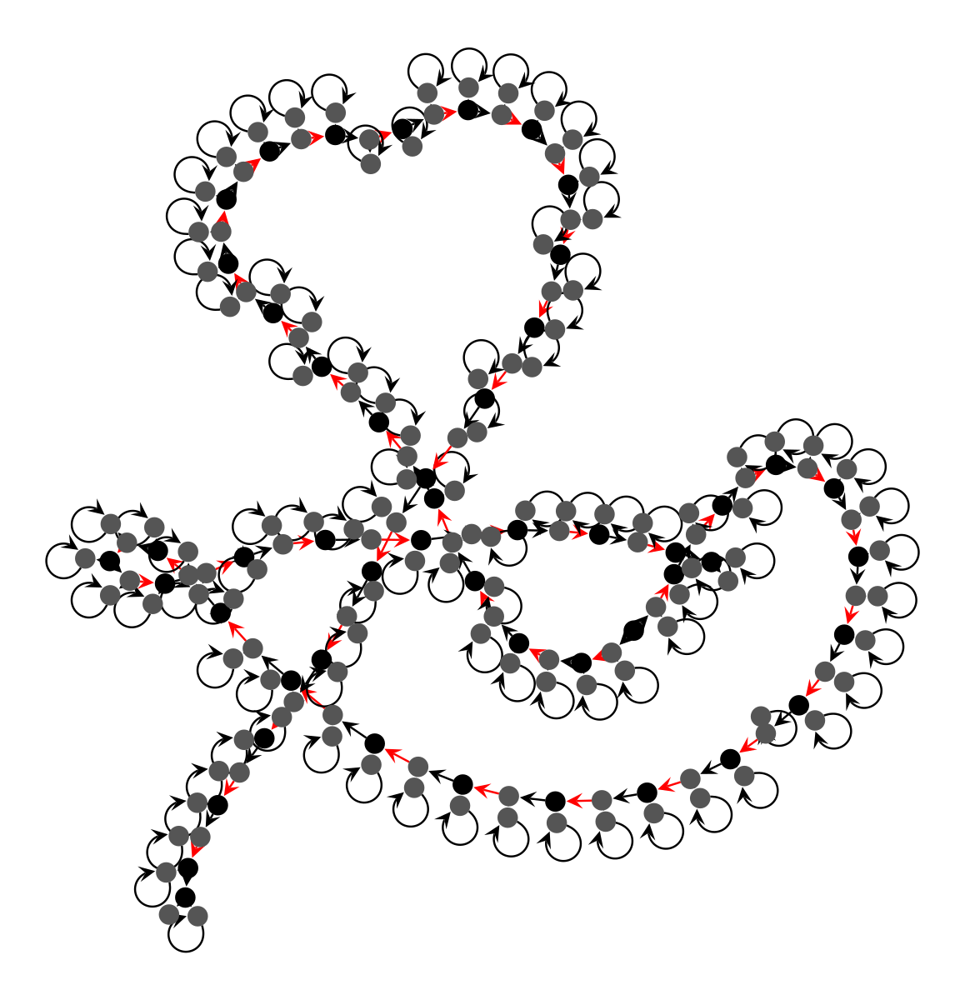
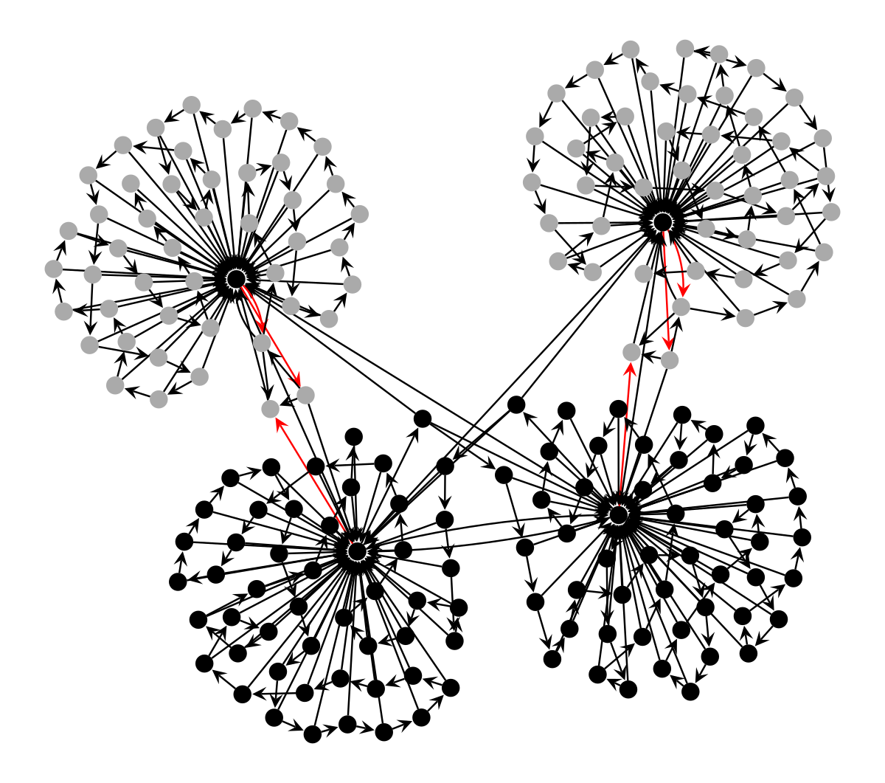

# Reservoir Developmental Graph Cellular Automata

Developed for the Lancaster University BSc Computer Science thesis project. Find it attached in `bsc_thesis.pdf`.

<div align="center">
    
    
</div>

<div align="center">
    
    <p><em>Sampled best-performing NARMA-10 reservoirs.</em></p>
</div>

## Installing Dependencies

* If using conda:

```
$ conda env create -f environment.yml
$ conda activate dgca_tasks
```
* This project uses **graph-tool**, which cannot be installed using pip. See here for details: https://graph-tool.skewed.de/installation.html.

    * For this reason it is much easier to install all the dependecies using conda, as shown above.

## Credits

* [Matias Barandiaran](https://github.com/m4mbo) - Author.
* James Stovold - Supervisor.
